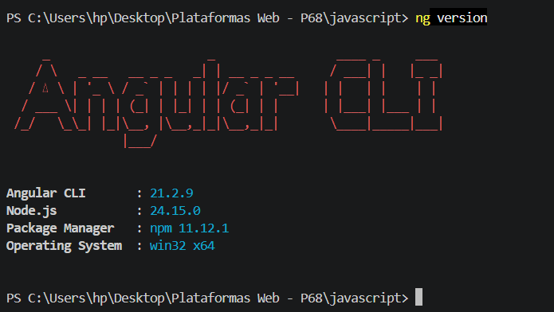
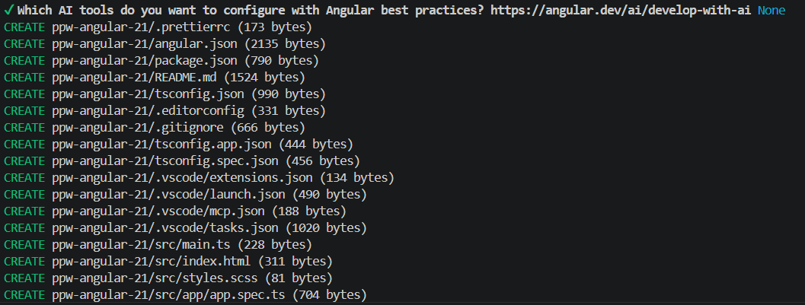
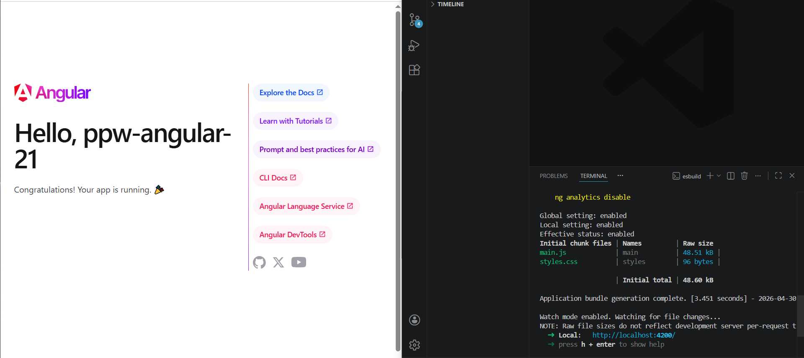
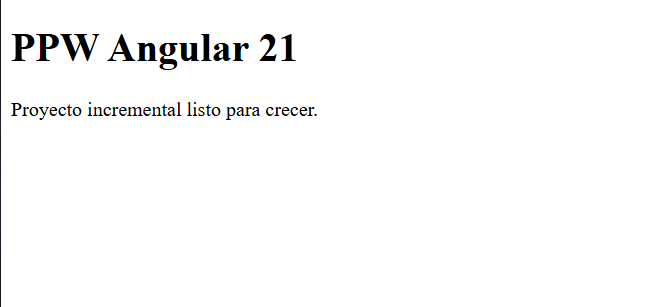

# Programación y Plataformas Web

# Angular para Desarrollo Web

<div align="center">
  
</div>

---

## Módulo 1: Instalación y Configuración del Entorno - Práctica

---

## Objetivo

Crear el proyecto incremental **`ppw-angular-21`** utilizando Angular CLI, con routing habilitado y una estructura base organizada para futuras prácticas.

---

## Descripción

En esta práctica se configuró el entorno de desarrollo para Angular, incluyendo la instalación de Node.js, Angular CLI y la creación de un proyecto base funcional.

Además, se implementó una estructura inicial modular utilizando `features/` y se configuró el enrutamiento para mostrar una página principal personalizada.

---

## Tecnologías utilizadas

* Angular 21
* Node.js
* npm
* TypeScript
* SCSS

---

## Ejecución del proyecto

1. Clonar el repositorio:

```bash
git clone https://github.com/PabloT18/ppw-angular-21.git
cd ppw-angular-21
```

2. Instalar dependencias:

```bash
npm install
```

3. Ejecutar el servidor:

```bash
npm start
```

4. Abrir en el navegador:

```
http://localhost:4200
```

---

## Estructura del proyecto

```
src/
  app/
    app.config.ts
    app.routes.ts
    app.ts
    features/
      home/
        pages/
          home-page.ts
```

---

## Implementación realizada

* Creación del proyecto Angular con Angular CLI
* Configuración de rutas (`app.routes.ts`)
* Creación de componente `HomePage`
* Uso de `RouterOutlet` para renderizado dinámico
* Organización modular con `features/`
* Personalización de estilos globales

---

## Evidencias

### 1. Versión de Angular CLI



**Descripción:** Verificación de la instalación correcta de Angular CLI y Node.js.

---

### 2. Creación del proyecto



**Descripción:** Proceso de creación del proyecto con Angular CLI.

---

### 3. Aplicación inicial de Angular



**Descripción:** Página por defecto generada por Angular antes de realizar modificaciones.

---

### 4. HomePage personalizada



**Descripción:** Página principal modificada mostrando el mensaje personalizado del proyecto.

---

## Validaciones

* ✔ Angular CLI instalado correctamente
* ✔ Proyecto creado sin errores
* ✔ Servidor ejecutándose en `localhost:4200`
* ✔ Ruta `/` funcionando correctamente
* ✔ Página personalizada renderizada
* ✔ Redirección con wildcard (`**`) funcionando

---

## Entregables

* Repositorio en GitHub con el proyecto funcional
* README documentado
* Capturas de evidencia en carpeta `assets/`

---

## Conclusión

Se logró configurar correctamente el entorno de desarrollo Angular y crear una base sólida para el desarrollo de futuras prácticas, siguiendo buenas prácticas de organización y estructura del proyecto.

---
