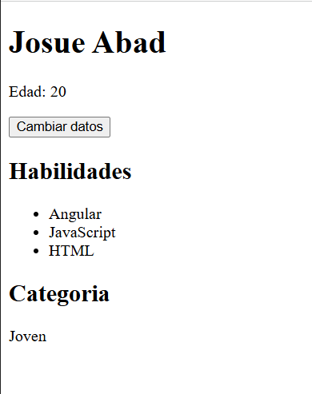

# Programación y Plataformas Web

# Frameworks Web: Angular 21

<div align="center">
  
</div>

## 02. Fundamentos de Angular - Práctica

### Autor

**Josue Abad**
💻 GitHub: Josue0522

---

## 1. Objetivo

Extender el proyecto `ppw-angular-21` para practicar el uso de:

* Componentes standalone
* Signals
* Computed
* Control flow moderno (`@if`, `@for`, `@switch`)
* Binding y actualización de estado

---

## 2. Descripción de la práctica

En esta práctica se creó una nueva feature llamada **profile**, donde se muestra información personal, habilidades y una categoría de edad dinámica.

Se aplicaron conceptos modernos de Angular 21 para manejar estado reactivo y renderizado declarativo.

---

## 3. Estructura del proyecto

```
src/
  app/
    features/
      home/
        pages/
          home-page.ts
      profile/
        pages/
          profile-page.ts
          profile-page.html
```

---

## 4. Funcionalidades implementadas

### Uso de Signals

Se definieron variables reactivas:

```ts
readonly firstName = signal('Josue');
readonly lastName = signal('Abad');
readonly age = signal(20);
readonly skills = signal(['Angular', 'JavaScript', 'HTML']);
```

---

### Computed

Se calcula el nombre completo dinámicamente:

```ts
readonly fullName = computed(() => `${this.firstName()} ${this.lastName()}`);
```

---

### Actualización de estado

Botón que cambia los datos:

```ts
changeData() {
  this.firstName.set('Ana');
  this.lastName.set('Gonzalez');
  this.age.set(22);
}
```

---

### Renderizado con `@if` y `@for`

Lista de habilidades:

```html
@if (skills().length > 0) {
  <ul>
    @for (skill of skills(); track skill) {
      <li>{{ skill }}</li>
    }
  </ul>
} @else {
  <p>No hay habilidades registradas.</p>
}
```

---

### Uso de `@switch`

Clasificación de edad:

```ts
readonly ageCategory = computed(() => {
  const value = this.age();

  if (value < 18) return 'minor';
  if (value < 30) return 'young';
  if (value < 60) return 'adult';
  return 'senior';
});
```

```html
@switch (ageCategory()) {
  @case ('minor') {
    <p>Menor de edad</p>
  }
  @case ('young') {
    <p>Joven</p>
  }
  @case ('adult') {
    <p>Adulto</p>
  }
  @default {
    <p>Senior</p>
  }
}
```

---

## 5. Navegación

Se agregó la ruta `/profile` en:

```ts
app.routes.ts
```

Y un enlace desde la página principal:

```html
<a href="/profile">Ir al perfil</a>
```

---

## 6. Evidencias

### Página de perfil funcionando



**Descripción:**
Se muestra el nombre completo, edad, lista de habilidades, botón para cambiar datos y la categoría dinámica según la edad.

---

## 7. Validaciones cumplidas

* ✔ Ruta `/profile` funcional
* ✔ Uso de signals y computed
* ✔ Actualización dinámica con botón
* ✔ Renderizado con `@if`, `@for` y `@switch`
* ✔ Navegación desde HomePage

---

## 8. Ejecución del proyecto

```bash
npm install
npm start
```

Abrir en el navegador:

```
http://localhost:4200/profile
```

---

## 9. Commits realizados

```bash
feat: agregar feature profile con signals
feat: control flow moderno en profile page
refactor: organizar fundamentos por feature
```

---

## 10. Conclusión

Esta práctica permitió comprender el uso de herramientas modernas de Angular 21 como signals y control flow estructurado, facilitando la creación de interfaces dinámicas y reactivas sin necesidad de utilizar `*ngIf` o `*ngFor`.

---
